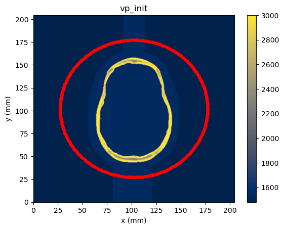
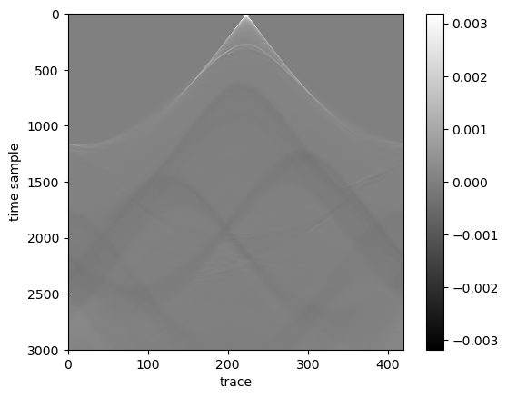
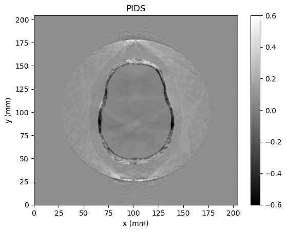

An implementation of the Physics Informed Summary Statistics (PIDS) data-reduction method described by Orozoco et al (2023). PIDS are used in the context of posterior sampling for conditioning seismic data into neural networks by making use of score of likelihoods.

This implementation makes use of [`Stride`](https://github.com/trustimaging/stride) to perform forward modelling and adjoint computations, and adopts its format for data storing and loading.

(a) Starting model and acquisition (red dots are sources and receiver locations)

(b) Raw observed data of a single shot from the true model

(c) PIDS 
